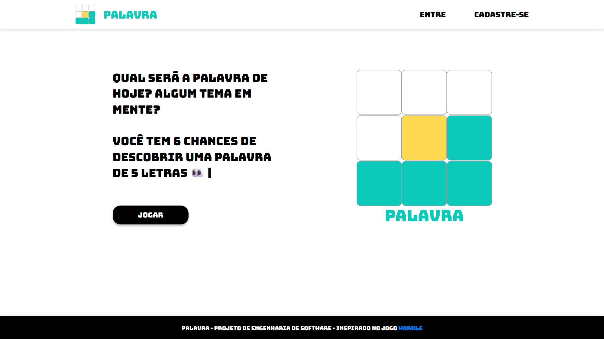
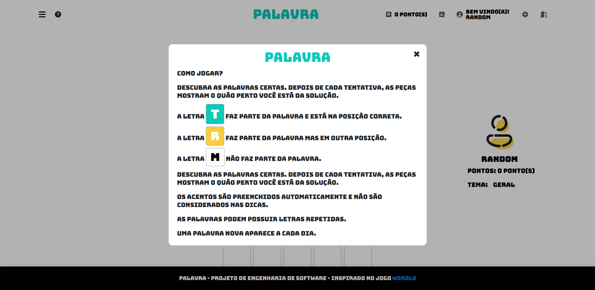

# PALAVRA
**PALAVRA** é um jogo baseado na web, inspirado no popular jogo online Wordle (ou term.ooo).<br>

No **PALAVRA**, os jogadores devem adivinhar uma palavra oculta dentro de um número limitado de tentativas.<br>
O jogo fornece feedback sobre a precisão das tentativas para ajudar os jogadores a deduzirem a palavra correta.

<div align="center">
   
   <br>

   

</div>

## Instalação

### Clonando o repositório
```bash
git clone https://github.com/leticia-pontes/PALAVRA
cd PALAVRA
```

### Com Docker

1. Construa a imagem Docker:
   ```bash
   docker build -t palavra-image .
   ```
2. Execute o container:
   ```bash
   docker run -d -p 5200:5200 --name palavra-service palavra-image
   ```
3. Acesse o aplicativo em seu navegador:
   ```bash
   http://localhost:5200
   ```

### Sem Docker

1. Crie um ambiente virtual (opcional, mas recomendado):
   ```bash
   python -m venv venv
   source venv/bin/activate  # Para Linux/Mac
   venv\Scripts\activate  # Para Windows
   ```
2. Instale as dependências:
   ```bash
   pip install -r requirements.txt
   ```

3. Aplique as migrações do banco de dados:
   ```bash
   python manage.py migrate
   ```
4. Execute o script de inserção no banco de dados:
   ```bash
   python criar_dicionario.py
   ```
5. Execute o servidor de desenvolvimento do Django:
   ```bash
   python manage.py runserver
   ```
6. Acesse o aplicativo em seu navegador:
   ```bash
   http://localhost:8000
   ```

## Como Jogar
1. Inicie o jogo visitando o servidor de desenvolvimento local e clicando em JOGAR.
2. Efetue o Login. Se não tiver um usuário, crie um em `Cadastre-se`.
2. Insira sua tentativa no campo de entrada.
3. Envie sua tentativa e receba o feedback.
4. Use o feedback para adivinhar a palavra dentro das tentativas dadas.

## Testes

Execute os testes para garantir que a aplicação está funcionando corretamente:
```
python manage.py test
```
Para verificar a cobertura de código:
```
coverage run --source='.' manage.py test
coverage report
```

## Pipeline de CI/CD
O projeto utiliza o GitLab CI/CD para integração e implantação contínuas. O pipeline está definido no arquivo `.gitlab-ci.yml` e inclui etapas para testes, construção e implantação da aplicação.

## Licença
Nenhuma (até o momento).

## Contribuidores
- [Beatriz Barbosa Bandeira](https://github.com/BiabBandeira)
- [Giovana Cristina dos Santos Castro](https://github.com/GiCCastro)
- [Giovana dos Santos Oliveira](https://github.com/giovanaoliveira-14)
- [Isabella Estella de Oliveira](https://github.com/IsaEstellaa)
- [Letícia Alves de Pontes](https://github.com/leticia-pontes)

## Agradecimentos
- Inspirado nos originais [Wordle](https://www.nytimes.com/games/wordle/index.html) e [Termo](https://term.ooo/)
---
#### *NENHUMA ALTERAÇÃO PODE SER FEITA NESTE PROJETO SEM A DEVIDA COMUNICAÇÃO E AUTORIZAÇÃO.*
